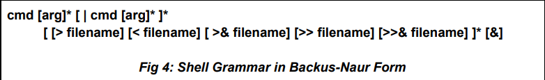

# Custom Shell

This is a custom shell implementation that includes a parser, executor, and subsystems. You can use the `help` command inside the shell to get a list of available commands.

## Features

- **Parser**: Handles command input and parses it for execution.
- **Executor**: Executes parsed commands and handles their output.
- **Shell Subsystems**: Includes various subsystems for enhanced shell functionality.
- **Help Command**: Displays a list of available commands.

## Grammar

The following diagram illustrates the grammar used in the shell:



## Requirements

To build and run the shell, you will need the following dependencies:

- `make`
- `flex`
- `byacc`

Install them using the following commands:

```bash
sudo apt install make
sudo apt install flex
sudo apt install byacc
```

## Usage

To compile, execute: `make`

Once built, you can run the shell by executing: `./shell`

Inside the shell, use the help command to view available commands.

## References

https://www.cs.purdue.edu/homes/grr/SystemsProgrammingBook/Book/Chapter5-WritingYourOwnShell.pdf
